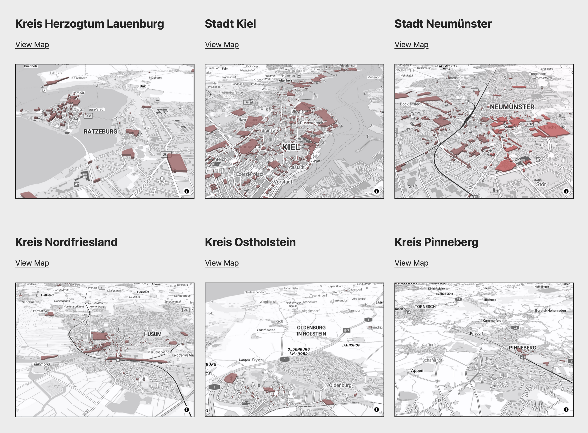

# Workshop Open Data Day 2025

**Monument maps for entire Schleswig-Holstein and its single districts:**

The maps are based on the [Open Data Day 2025 map](https://tursics.github.io/opendataday2025/) by Thomas Tursics. As data source, the maps use the prebuilt GeoJSON distributions from my side project *opendata.tomkyle.net:* [Historische Kulturdenkmale in Geo-Formaten](https://opendata.tomkyle.net/denkmallisten/denkmalpflege) 

## Screenshot

**[View Maps](https://tomkyle.github.io/opendataday2025/)**

## About the project

as authored by Thomas Tursics

We met in Flensburg on the International Open Data Day 2025 on March 1st. After a few keynote speeches in the morning, we built online maps from Scratch in the afternoon. I took up the idea of ​​the new list of monuments from Schleswig-Holstein and visualized it on a map.

## Implementation
as authored by Thomas Tursics

1. The basic structure of a map was set up with HTML, JS, CSS and a little boilerplate. I chose MapLibre GL JS because it allows you to use vector maps that can be zoomed, rotated, tilted as desired and thus also display 3D buildings.

2. In order to display data on the maps, I looked for GeoJSON files in the Open Data Portal of Schleswig-Holstein, which also contain data from Flensburg. I found these: https://opendata.schleswig-holstein.de/dataset/geodaten-denkmalliste-sh-2025-03-01

3. Unfortunately, the contents of the GeoJSON file are not displayed on the map. In QGIS I changed the projection from UTM 32 to WGS 84 and thus converted all coordinates.

4. The resulting file was still too large to upload to GitHub. That's why I only filtered out the monuments in Flensburg in QGIS.

5. Finished.

The raster data map layer from OK Lab Flensburg (https://tiles.oklabflensburg.de/fosm/{z}/{x}/{y}.png) was presented and used in the workshop. I couldn't manage that and switched to the vector layer from Basemap.de.
